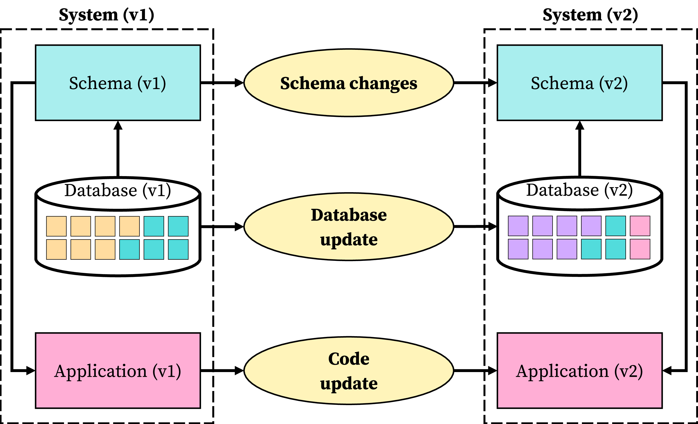
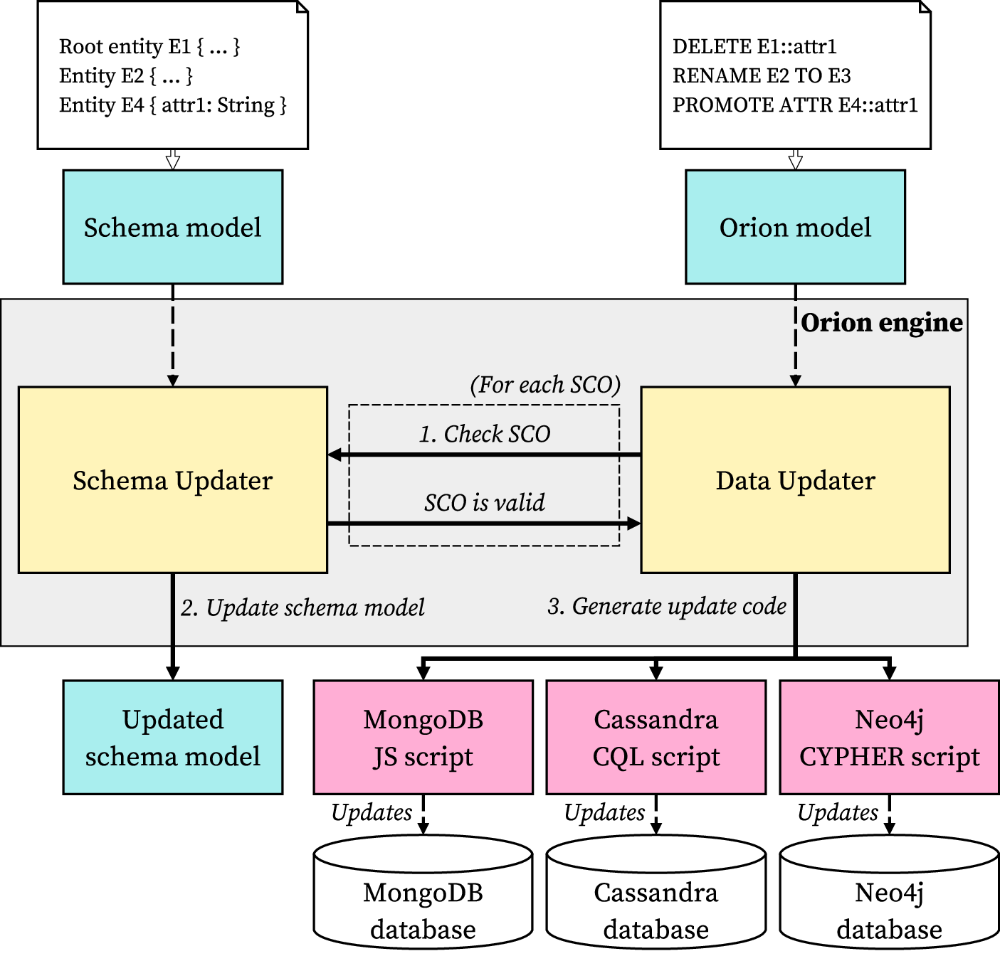
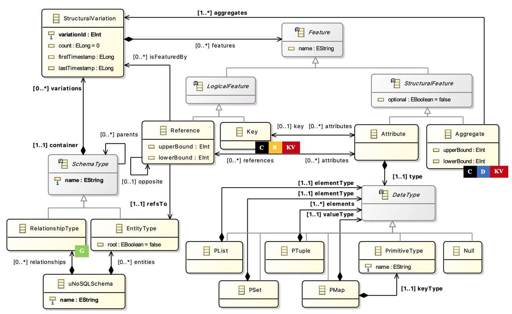
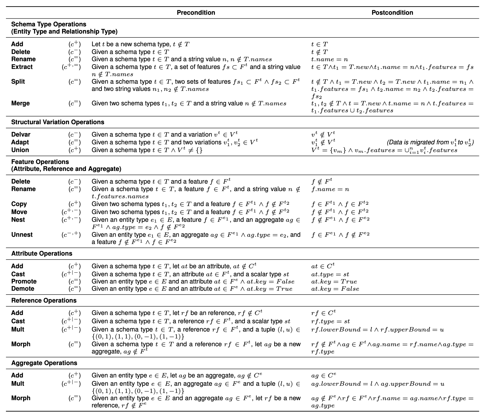
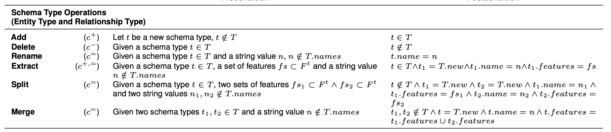
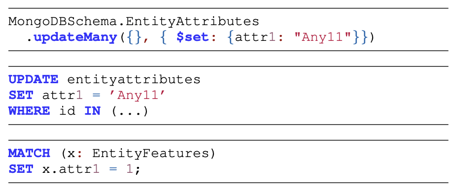
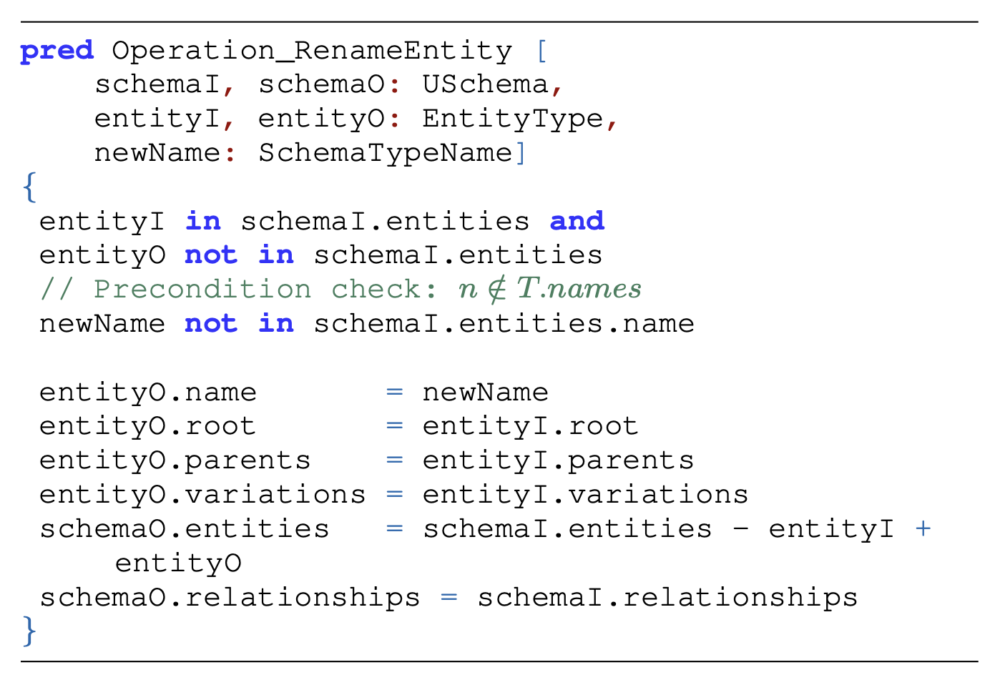
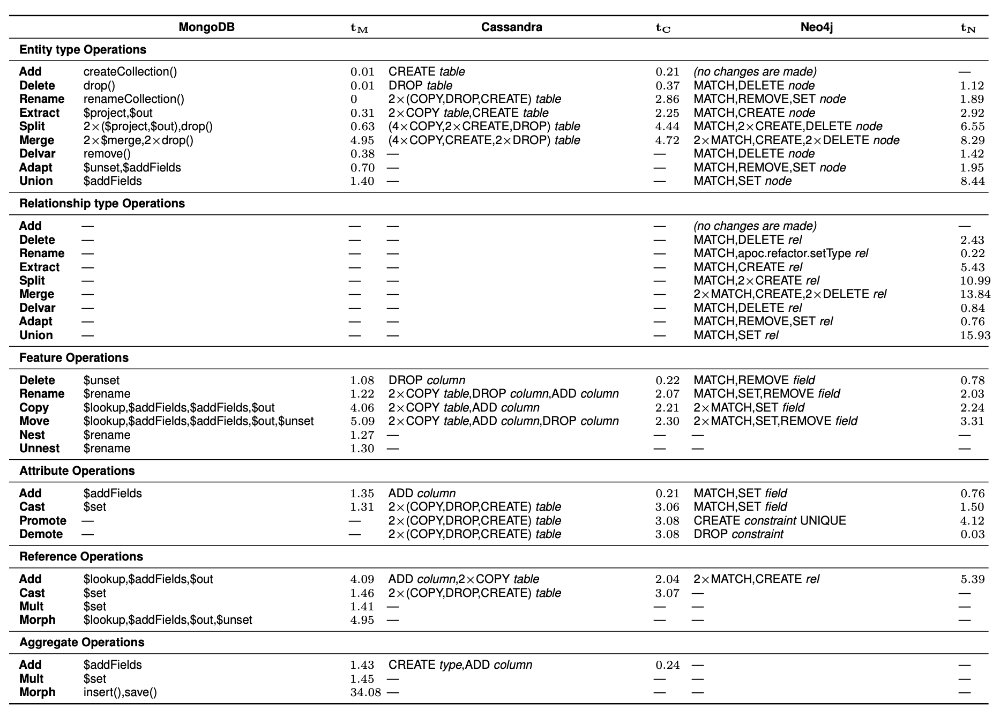
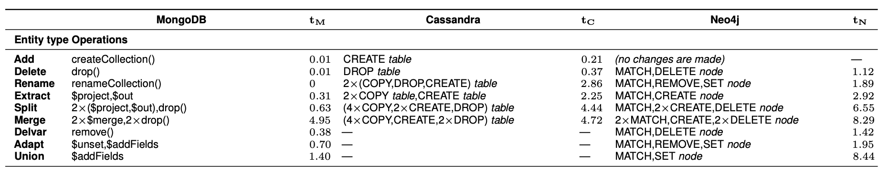

<style scoped>
img[alt~="center"] {  display: block;  margin: 0 auto;}
</style>


# A Generic Schema Evolution Approach for NoSQL and Relational Databases
{{ slide_style() }}

<!-- _class: lead  -->
Alberto Hernández Chillón, Meike Klettke,
**Diego Sevilla Ruiz**, Jesús García Molina

Jornadas de Ingeniería del Software y Bases de Datos,
Córdoba, 2025

## Motivation

{{ slide_style() }}

<!-- _class: invert
-->

<style scoped>
  h2 {
    padding: 10%;
    font-size: 70pt;
  }
</style>

---
{{ slide_style() }}
<style scoped>
img[alt~="center"] {  display: block;  margin: 0 auto;}
</style>

{{ generate_mermaid_diagram('slide_schema1','''
    direction LR
    SLIDESHOW {
        string name PK
        string email
        string author
        timestamp created_at
    }

    TITLESLIDE {
        uuid id PK
        string main_title
        string authors
        timestamp date
        string additional_info
        text notes
    }

    SLIDESHOW ||--|| TITLESLIDE : title_slide
''', 900, -1, 'erDiagram', 'png') }}


---
{{ slide_style() }}

```python
from pymongo import AsyncMongoClient
from pymongo.asynchronous.database import AsyncDatabase

client: AsyncMongoClient = AsyncMongoClient(db_hostname, 27017)
db: AsyncDatabase = client.works

# Slideshow
jisbd2025: dict = {
    "name": "jisbd2025.md",
    "author": "Diego Sevilla Ruiz",
    "email": "dsevilla@um.es",
    "created_at": datetime.datetime.now()
}
await db.Slideshow.insert_one(jisbd2025)

# Titleslide
titleslide: dict = {
    "main_title": "A Generic Schema Evolution Approach for NoSQL and Relational Databases",
    "authors": "Alberto Hernández Chillón, Meike Klettke, Diego Sevilla Ruiz, Jesús García Molina",
    "notes": "..."
}
await db.Titleslide.insert_one(titleslide)

# Add slide to slideshow (slides)
jisbd2025.title_slide = titleslide._id

await db.Slideshow.replace_one(jisbd2025)
```

---
{{ slide_style() }}

<div class="columns">
<div>

```python
async with aiosqlite.connect(db_path) as db:
  # create tables
  await db.execute('''
  CREATE TABLE IF NOT EXISTS Slideshow (
      name TEXT PRIMARY KEY AUTOINCREMENT,
      email TEXT,
      author TEXT,
      created_at TIMESTAMP,
      title_slide INTEGER,
      FOREIGN KEY (title_slide)
              REFERENCES Titleslide(id)
  )
  ''')

  await db.execute('''
  CREATE TABLE IF NOT EXISTS Titleslide (
      id INTEGER PRIMARY KEY AUTOINCREMENT,
      main_title TEXT,
      authors TEXT,
      date TIMESTAMP,
      additional_info TEXT,
      notes TEXT
  )
  ''')
  await db.commit()
```
</div>
<div>

```python
# Insert Titleslide
await db.execute(
  '''INSERT INTO Titleslide (id, main_title, authors, date,
                             additional_info, notes)
      VALUES (?, ?, ?, ?, ?, ?);
  ''',
  (
    1,
    "A Generic Schema Evolution...",
    "Alberto Hernández Chillón, Meike Klettke, ...",
    datetime.datetime.now(),
    "",
    "notes",
  )
)
await db.commit()

await db.execute(
  '''INSERT INTO slideshow (name, author, email,
                            created_at, title_slide)
    VALUES (?, ?, ?, ?, ?);
    ''',
  ("pr.md", "Diego Sevilla", "dsevilla@um.es", 4, 1),
)
await db.commit()
```
</div>
</div>

### Athena Schema
{{ slide_style() }}


{{ generate_enhanced_code_block('Athena', '''
Root entity Slideshow {
  +name String,
  email String,
  author String,
  created_at Timestamp,
  title_slide Ref<Titleslide AS UUID>&
}

Entity Titleslide {
  +id UUID,
  main_title String,
  authors String,
  date Timestamp,
  additional_info String,
  notes String
}
'''
) }}

### Orion
{{ slide_style() }}

{{ generate_enhanced_code_block('Orion', '''
Slideshow OPERATIONS

ADD ENTITY Slideshow: (
    +name: STRING,
    email: STRING,
    author: STRING,
    created_at: TIMESTAMP,
    title_slide: REF<Titleslide AS UUID>&
)
ADD ENTITY Titleslide: (
    +id: UUID,
    main_title: STRING,
    authors: STRING,
    date: TIMESTAMP,
    additional_info: STRING,
    notes: STRING
)
'''
) }}

---
{{ slide_style() }}
<style scoped>
img[alt~="center"] {  display: block;  margin: 0 auto;}
</style>

{{ generate_mermaid_diagram('slide_schema2','''
    direction LR
    SLIDESHOW {
        string name PK
        string email
        string author
        timestamp created_at
    }

    TITLESLIDE {
        uuid id PK
        string main_title
        string authors
        timestamp date
        string additional_info
        text notes
    }

    SLIDE {
        uuid id PK
        string title
        text body
        text notes
    }

    SLIDESHOW ||--|| TITLESLIDE : title_slide
    SLIDESHOW |o..|{ SLIDE : slides
''', 700, -1, 'erDiagram', 'png') }}

---
{{ slide_style() }}

<style scoped>
section { font-size: 50pt; }
</style>

* Schema changes

* Data change

* Code change


### Flyway/Liquibase

{{ slide_style() }}

```json
{
  "change":
  [
    {
      "changeSet": {
        "id": "1",
        "author": "dsevilla",
        "changes": [
          {
            "createTable": {
              "tableName": "Slideshow",
              "columns": [
                { "column": { "name": "name", "type": "TEXT",
                              "constraints": { "primaryKey": true, "autoIncrement": true } } },
                { "column": { "name": "email", "type": "TEXT" } },
                { "column": { "name": "author", "type": "TEXT" } },
                { "column": { "name": "created_at", "type": "TIMESTAMP" } }
              ]
            }
          }
        ]
      }
    }
  ]
}
```

## Proposal
{{ slide_style() }}
<!-- _class: invert
-->
<style scoped>
  h2 {
    padding: 10%;
    font-size: 70pt;
  }
</style>


---
{{ slide_style() }}

<style scoped>
img[alt~="center"] {  display: block;  margin: 0 auto;}
</style>



---
{{ slide_style() }}

<style scoped>
img[alt~="center"] {  display: block;  margin: 0 auto;}
</style>



---
{{ slide_style() }}

<style scoped>
img[alt~="center"] {  display: block;  margin: 0 auto;}
</style>




---
{{ slide_style() }}

<style scoped>
img[alt~="center"] {  display: block;  margin: 0 auto;}
</style>



---
{{ slide_style() }}

<style scoped>
img[alt~="center"] {  display: block;  margin: 0 auto;}
</style>



---
{{ slide_style() }}

{{ generate_enhanced_code_block('Orion', '''
Using Sales_department:1

// Sale operations
CAST ATTR *::profits TO Double
DELETE Sale::isActive

// PersonalData operations
CAST ATTR PersonalData::postcode TO String
ADD AGGR PersonalData::address:{country:String}& AS Address
NEST PersonalData::city, postcode, street TO address

// Salesperson operations
ADAPT ENTITY Salesperson::v1 TO v2
NEST Salesperson::email TO personalData
MORPH AGGR Salesperson::personalData TO privateData
RENAME ENTITY Salesperson TO Employee

...''')
}}

---
{{ slide_style() }}

<style scoped>
img[alt~="center"] {  display: block;  margin: 0 auto;}
</style>




## Validation
{{ slide_style() }}
<!-- _class: invert
-->
<style scoped>
  h2 {
    padding: 10%;
    font-size: 70pt;
  }
</style>

---
**Alloy**
{{ slide_style() }}

<style scoped>
img[alt~="center"] {  display: block;  margin: 0 auto;}
</style>



## Performance
{{ slide_style() }}
<!-- _class: invert
-->
<style scoped>
  h2 {
    padding: 10%;
    font-size: 70pt;
  }
</style>

---
{{ slide_style() }}

<style scoped>
img[alt~="center"] {  display: block;  margin: 0 auto;}
</style>



---
{{ slide_style() }}

<style scoped>
img[alt~="center"] {  display: block;  margin: 0 auto;}
</style>



## Future
{{ slide_style() }}
<!-- _class: invert
-->
<style scoped>
  h2 {
    padding: 10%;
    font-size: 70pt;
  }
</style>

---
{{ slide_style() }}

<style scoped>
section { font-size: 32pt; }
</style>

* Automatic co-evolution of code
* More operations in Orion (e.g., hierarchy)
* More NoSQL and NewSQL targets
* Study of reordering of SCOs, dependencies, nullability and parallellization
* Use as a basis for database migration

## Thanks!
{{ slide_style() }}
<!-- _class: invert
-->
<style scoped>
  h2 {
    padding: 10%;
    font-size: 70pt;
  }
</style>
