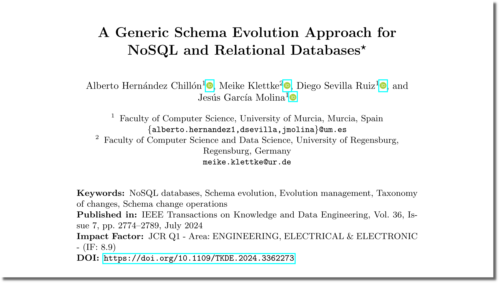

<style scoped>
img[alt~="center"] {  display: block;  margin: 0 auto;}
</style>



# A Generic Schema Evolution Approach for NoSQL and Relational Databases
<style scoped>
  /* Large blurred pastel counter in the background of each slide */
  section::before {
    content: "1";
    position: absolute;
    left: 50%;
    top: 50%;
    transform: translate(40%, -40%);
    font-family: 'Bodoni Moda', cursive;
    font-size: 700pt;
    line-height: 1;
    color: rgba(255, 200, 210, 0.55); /* pastel pink */
    #filter: blur(8px);
    opacity: 0.4;
    z-index: 0;
    pointer-events: none;
    white-space: nowrap;
    -webkit-font-smoothing: antialiased;
    -moz-osx-font-smoothing: grayscale;
  }

  /* Keep slide content above the background digit */
  section > * {
    position: relative;
    z-index: 1;
  }
  </style>

<!-- _class: lead  -->
Alberto Hernández Chillón, Meike Klettke,
**Diego Sevilla Ruiz**, Jesús García Molina

Jornadas de Ingeniería del Software y Bases de Datos,
Córdoba. 2025

---
<style scoped>
  /* Large blurred pastel counter in the background of each slide */
  section::before {
    content: "2";
    position: absolute;
    left: 50%;
    top: 50%;
    transform: translate(40%, -40%);
    font-family: 'Bodoni Moda', cursive;
    font-size: 700pt;
    line-height: 1;
    color: rgba(255, 200, 210, 0.55); /* pastel pink */
    #filter: blur(8px);
    opacity: 0.4;
    z-index: 0;
    pointer-events: none;
    white-space: nowrap;
    -webkit-font-smoothing: antialiased;
    -moz-osx-font-smoothing: grayscale;
  }

  /* Keep slide content above the background digit */
  section > * {
    position: relative;
    z-index: 1;
  }
  </style>
<style scoped>
img[alt~="center"] {  display: block;  margin: 0 auto;}
</style>

<p></p>

---
<style scoped>
  /* Large blurred pastel counter in the background of each slide */
  section::before {
    content: "3";
    position: absolute;
    left: 50%;
    top: 50%;
    transform: translate(40%, -40%);
    font-family: 'Bodoni Moda', cursive;
    font-size: 700pt;
    line-height: 1;
    color: rgba(255, 200, 210, 0.55); /* pastel pink */
    #filter: blur(8px);
    opacity: 0.4;
    z-index: 0;
    pointer-events: none;
    white-space: nowrap;
    -webkit-font-smoothing: antialiased;
    -moz-osx-font-smoothing: grayscale;
  }

  /* Keep slide content above the background digit */
  section > * {
    position: relative;
    z-index: 1;
  }
  </style>

```python
from pymongo import AsyncMongoClient
from pymongo.asynchronous.database import AsyncDatabase

client: AsyncMongoClient = AsyncMongoClient(db_hostname, 27017)

db: AsyncDatabase = client.works

# Slideshow
jisbd2025: dict = {
    "name": "jisbd2025.md",
    "author": "Diego Sevilla Ruiz",
    "email": "dsevilla@um.es",
    "created_at": datetime.datetime.now()
}
await db.Slideshow.insert_one(jisbd2025)

# Slide
slide1: dict = {
    "title": "",
    "body": """marp: true
title: A Generic Schema Evolution Approach for NoSQL and Relational Databases
...""",
    "notes": ""
}
await db.Slide.insert_one(slide1)

# Add slide to slideshow (slides)
jisbd2025.slides.append(slide1._id)

await db.Slideshow.replace_one(jisbd2025)
```

---
<style scoped>
  /* Large blurred pastel counter in the background of each slide */
  section::before {
    content: "4";
    position: absolute;
    left: 50%;
    top: 50%;
    transform: translate(40%, -40%);
    font-family: 'Bodoni Moda', cursive;
    font-size: 700pt;
    line-height: 1;
    color: rgba(255, 200, 210, 0.55); /* pastel pink */
    #filter: blur(8px);
    opacity: 0.4;
    z-index: 0;
    pointer-events: none;
    white-space: nowrap;
    -webkit-font-smoothing: antialiased;
    -moz-osx-font-smoothing: grayscale;
  }

  /* Keep slide content above the background digit */
  section > * {
    position: relative;
    z-index: 1;
  }
  </style>

```python
async with aiosqlite.connect(db_path) as db:
    # create tables
    await db.execute('''
    CREATE TABLE IF NOT EXISTS slideshow (
        id INTEGER PRIMARY KEY AUTOINCREMENT,
        name TEXT,
        meta TEXT,
        source_file TEXT,
        slides_count INTEGER
    )
    ''')

    await db.execute('''
    CREATE TABLE IF NOT EXISTS slide (
        id INTEGER PRIMARY KEY AUTOINCREMENT,
        slideshow_id INTEGER,
        idx INTEGER,
        title TEXT,
        body TEXT,
        notes TEXT,
        FOREIGN KEY(slideshow_id) REFERENCES slideshow(id)
    )''')
    await db.commit()

    # explicit slideshow insert (matches MongoDB slideshow insert above)
    slideshow_meta = {}
    await db.execute(
        "INSERT INTO slideshow (name, meta, source_file, slides_count) VALUES (?, ?, ?, ?)",
        ("pr.md", json.dumps(slideshow_meta), "pr.md.j2", 4),
    )
    await db.commit()

    # get last slideshow id
    async with db.execute("SELECT last_insert_rowid()") as cur:
        row = await cur.fetchone()
        slideshow_id = row[0]

    # explicit slide inserts (no loop) — mirror the MongoDB slides above
    await db.execute(
        "INSERT INTO slide (slideshow_id, idx, title, body, notes) VALUES (?, ?, ?, ?, ?)",
        (
            slideshow_id,
            1,
            "",
            """marp: true
title: A Generic Schema Evolution Approach for NoSQL and Relational Databases
theme: default
...""",
            "",
            "pr.md.j2",
        ),
    )
    await db.commit()
```

## Almacenamiento

<style scoped>
  /* Large blurred pastel counter in the background of each slide */
  section::before {
    content: "5";
    position: absolute;
    left: 50%;
    top: 50%;
    transform: translate(40%, -40%);
    font-family: 'Bodoni Moda', cursive;
    font-size: 700pt;
    line-height: 1;
    color: rgba(255, 200, 210, 0.55); /* pastel pink */
    #filter: blur(8px);
    opacity: 0.4;
    z-index: 0;
    pointer-events: none;
    white-space: nowrap;
    -webkit-font-smoothing: antialiased;
    -moz-osx-font-smoothing: grayscale;
  }

  /* Keep slide content above the background digit */
  section > * {
    position: relative;
    z-index: 1;
  }
  </style>

<!-- _class: invert
-->

<style scoped>
  h2 {
    padding: 10%;
    font-size: 70pt;
  }
</style>


### Introducción

<style scoped>
  /* Large blurred pastel counter in the background of each slide */
  section::before {
    content: "6";
    position: absolute;
    left: 50%;
    top: 50%;
    transform: translate(40%, -40%);
    font-family: 'Bodoni Moda', cursive;
    font-size: 700pt;
    line-height: 1;
    color: rgba(255, 200, 210, 0.55); /* pastel pink */
    #filter: blur(8px);
    opacity: 0.4;
    z-index: 0;
    pointer-events: none;
    white-space: nowrap;
    -webkit-font-smoothing: antialiased;
    -moz-osx-font-smoothing: grayscale;
  }

  /* Keep slide content above the background digit */
  section > * {
    position: relative;
    z-index: 1;
  }
  </style>

<style scoped>
  section { font-size: 22pt; }
</style>

- El almacenamiento forma parte del concepto de estado de una aplicación o servicio
- Las principales dimensiones que valoramos para escoger un tipo de almacenamiento u otro son:
  - Unidad de acceso  mímina
  - Métricas y valores de rendimiento
  - Forma de acceso, concurrencia
  - Elasticidad
  - Disponibilidad
  - Capacidades extra (ej: versionado, ciclo de vida)


## Almacenamiento a nivel de bloque

<style scoped>
  /* Large blurred pastel counter in the background of each slide */
  section::before {
    content: "7";
    position: absolute;
    left: 50%;
    top: 50%;
    transform: translate(40%, -40%);
    font-family: 'Bodoni Moda', cursive;
    font-size: 700pt;
    line-height: 1;
    color: rgba(255, 200, 210, 0.55); /* pastel pink */
    #filter: blur(8px);
    opacity: 0.4;
    z-index: 0;
    pointer-events: none;
    white-space: nowrap;
    -webkit-font-smoothing: antialiased;
    -moz-osx-font-smoothing: grayscale;
  }

  /* Keep slide content above the background digit */
  section > * {
    position: relative;
    z-index: 1;
  }
  </style>

<!-- _class: invert
-->

<style scoped>
  h2 {
    padding: 10%;
    font-size: 70pt;
  }
</style>


### S3: PUT de un objeto
<style scoped>
  /* Large blurred pastel counter in the background of each slide */
  section::before {
    content: "8";
    position: absolute;
    left: 50%;
    top: 50%;
    transform: translate(40%, -40%);
    font-family: 'Bodoni Moda', cursive;
    font-size: 700pt;
    line-height: 1;
    color: rgba(255, 200, 210, 0.55); /* pastel pink */
    #filter: blur(8px);
    opacity: 0.4;
    z-index: 0;
    pointer-events: none;
    white-space: nowrap;
    -webkit-font-smoothing: antialiased;
    -moz-osx-font-smoothing: grayscale;
  }

  /* Keep slide content above the background digit */
  section > * {
    position: relative;
    z-index: 1;
  }
  </style>
- PUT sube un objeto a un *Bucket*
- Se puede subir de una vez o *multipart*
- Ejemplo:

```python
import re
```

<pre is="marp-pre" data-auto-scaling="downscale-only"><code class="language-python">import boto3
S3API = boto3.client(&quot;s3&quot;, region_name=&quot;us-east-1&quot;)
bucket_name= &quot;samplebucket&quot;
filename = &quot;/resources/website/core.css&quot;
S3API.upload_file(filename, bucket_name, &quot;core.css&quot;,
        ExtraArgs={&quot;ContentType&quot;: &quot;text/css&quot;,
                   &quot;CacheControl&quot;: &quot;max-age=0&quot;})</code></pre>
---
<style scoped>
  /* Large blurred pastel counter in the background of each slide */
  section::before {
    content: "9";
    position: absolute;
    left: 50%;
    top: 50%;
    transform: translate(40%, -40%);
    font-family: 'Bodoni Moda', cursive;
    font-size: 700pt;
    line-height: 1;
    color: rgba(255, 200, 210, 0.55); /* pastel pink */
    #filter: blur(8px);
    opacity: 0.4;
    z-index: 0;
    pointer-events: none;
    white-space: nowrap;
    -webkit-font-smoothing: antialiased;
    -moz-osx-font-smoothing: grayscale;
  }

  /* Keep slide content above the background digit */
  section > * {
    position: relative;
    z-index: 1;
  }
  </style>
<style scoped>
  pre {
    background: #f4f4f4;
    padding: 10px;
    font-size: 300%;
    border: 1px solid #ddd;
    border-radius: 5px;
  }
</style>

<pre>
abc
</pre>


### Other section
<style scoped>
  /* Large blurred pastel counter in the background of each slide */
  section::before {
    content: "10";
    position: absolute;
    left: 50%;
    top: 50%;
    transform: translate(-22%, -40%);
    font-family: 'Bodoni Moda', cursive;
    font-size: 700pt;
    line-height: 1;
    color: rgba(255, 200, 210, 0.55); /* pastel pink */
    #filter: blur(8px);
    opacity: 0.4;
    z-index: 0;
    pointer-events: none;
    white-space: nowrap;
    -webkit-font-smoothing: antialiased;
    -moz-osx-font-smoothing: grayscale;
  }

  /* Keep slide content above the background digit */
  section > * {
    position: relative;
    z-index: 1;
  }
  </style>

## Database Schema Example

<style scoped>
  /* Large blurred pastel counter in the background of each slide */
  section::before {
    content: "11";
    position: absolute;
    left: 50%;
    top: 50%;
    transform: translate(-22%, -40%);
    font-family: 'Bodoni Moda', cursive;
    font-size: 700pt;
    line-height: 1;
    color: rgba(255, 200, 210, 0.55); /* pastel pink */
    #filter: blur(8px);
    opacity: 0.4;
    z-index: 0;
    pointer-events: none;
    white-space: nowrap;
    -webkit-font-smoothing: antialiased;
    -moz-osx-font-smoothing: grayscale;
  }

  /* Keep slide content above the background digit */
  section > * {
    position: relative;
    z-index: 1;
  }
  </style>

Here's an example of how to include ER diagrams in your presentation:

<style scoped>
img[alt~="center"] { display: block;  margin: 0 auto;}
</style>

<p></p>


This diagram shows the schema evolution tracking system.

### More slides
<style scoped>
  /* Large blurred pastel counter in the background of each slide */
  section::before {
    content: "12";
    position: absolute;
    left: 50%;
    top: 50%;
    transform: translate(-22%, -40%);
    font-family: 'Bodoni Moda', cursive;
    font-size: 700pt;
    line-height: 1;
    color: rgba(255, 200, 210, 0.55); /* pastel pink */
    #filter: blur(8px);
    opacity: 0.4;
    z-index: 0;
    pointer-events: none;
    white-space: nowrap;
    -webkit-font-smoothing: antialiased;
    -moz-osx-font-smoothing: grayscale;
  }

  /* Keep slide content above the background digit */
  section > * {
    position: relative;
    z-index: 1;
  }
  </style>

### And more slides
<style scoped>
  /* Large blurred pastel counter in the background of each slide */
  section::before {
    content: "13";
    position: absolute;
    left: 50%;
    top: 50%;
    transform: translate(-22%, -40%);
    font-family: 'Bodoni Moda', cursive;
    font-size: 700pt;
    line-height: 1;
    color: rgba(255, 200, 210, 0.55); /* pastel pink */
    #filter: blur(8px);
    opacity: 0.4;
    z-index: 0;
    pointer-events: none;
    white-space: nowrap;
    -webkit-font-smoothing: antialiased;
    -moz-osx-font-smoothing: grayscale;
  }

  /* Keep slide content above the background digit */
  section > * {
    position: relative;
    z-index: 1;
  }
  </style>

### And even more
<style scoped>
  /* Large blurred pastel counter in the background of each slide */
  section::before {
    content: "14";
    position: absolute;
    left: 50%;
    top: 50%;
    transform: translate(-22%, -40%);
    font-family: 'Bodoni Moda', cursive;
    font-size: 700pt;
    line-height: 1;
    color: rgba(255, 200, 210, 0.55); /* pastel pink */
    #filter: blur(8px);
    opacity: 0.4;
    z-index: 0;
    pointer-events: none;
    white-space: nowrap;
    -webkit-font-smoothing: antialiased;
    -moz-osx-font-smoothing: grayscale;
  }

  /* Keep slide content above the background digit */
  section > * {
    position: relative;
    z-index: 1;
  }
  </style>