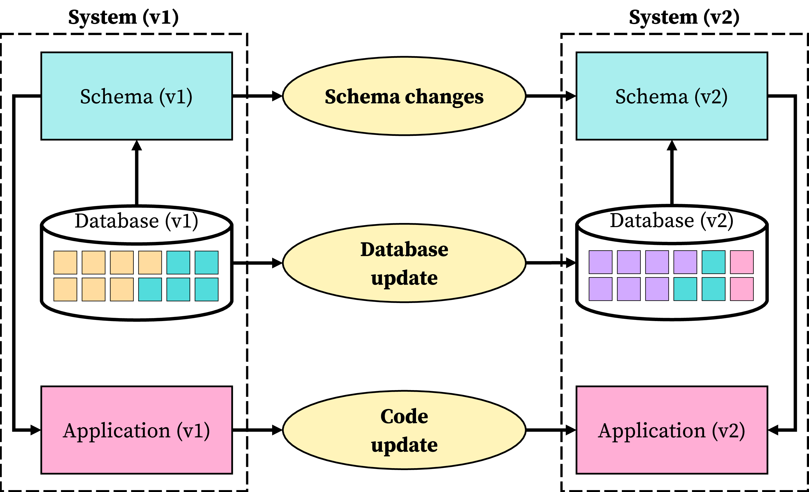
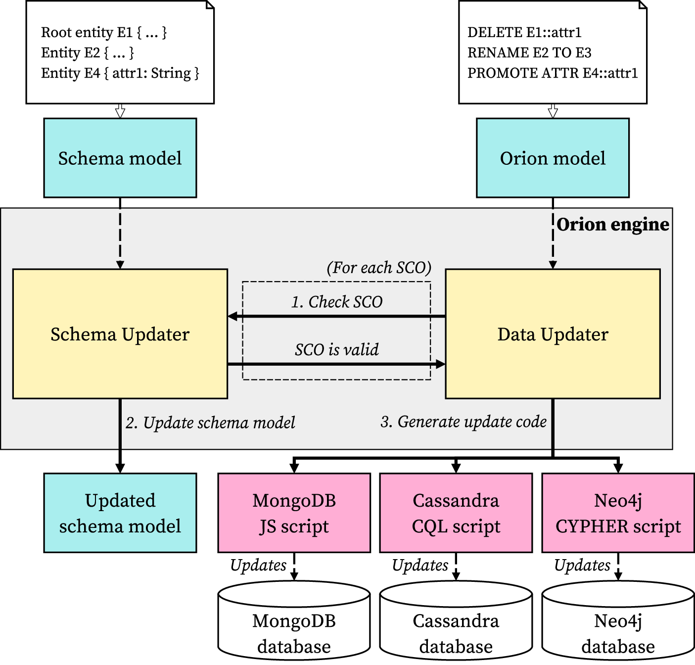
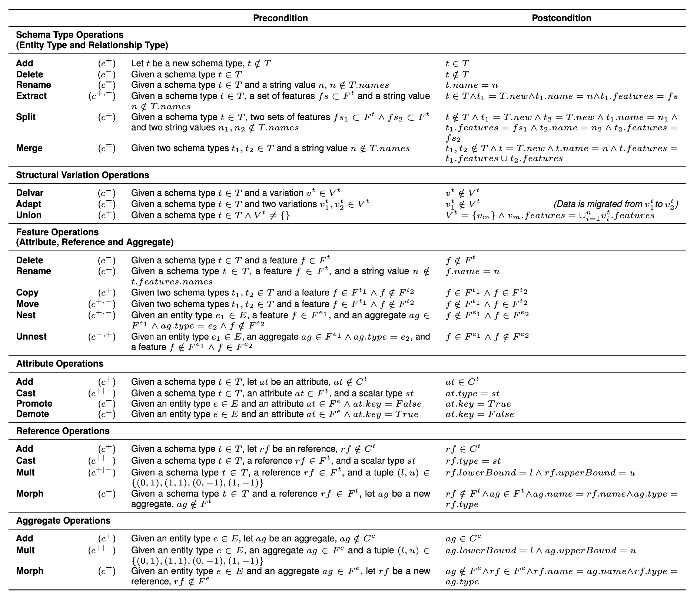
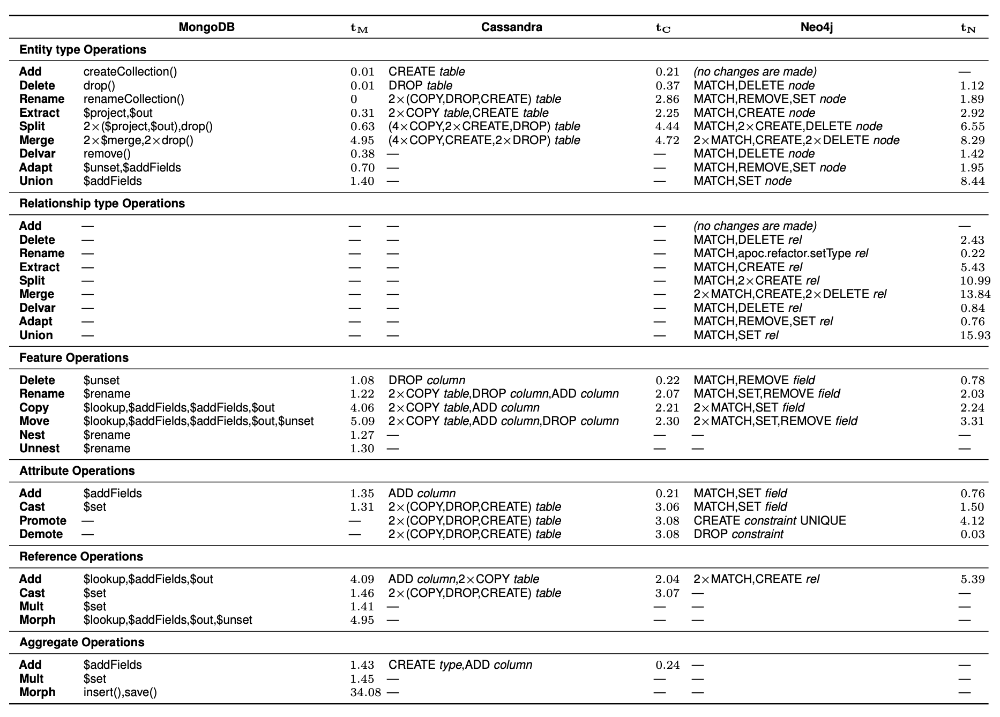
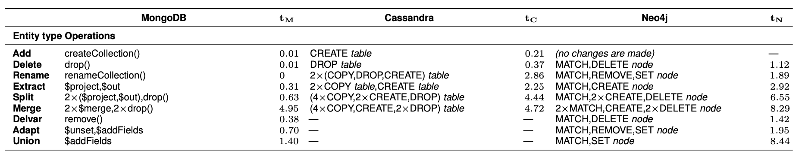

<style scoped>
img[alt~="center"] {  display: block;  margin: 0 auto;}
</style>


# A Generic Schema Evolution Approach for NoSQL and Relational Databases
<style scoped>
  /* Large blurred pastel counter in the background of each slide */
  section::before {
    content: "1";
  position: absolute;
  /* Right-align the large slide number so 1- and 2-digit numbers line up */
  right: -6%;
  top: 60%;
  transform: translateY(-50%);
  text-align: right;
    font-family: 'Bodoni Moda', serif;
  /*font-style: italic;*/
  font-size: 720pt;
  line-height: 1;
  /* Color and saturation are computed per-slide for contrast (no blur) */
  color: hsla(0, 60%, 85%, 0.55); /* pastel rainbow HSL */
  -webkit-filter: saturate(80%);
  filter: saturate(80%);
  opacity: 0.4;
    z-index: 0;
    pointer-events: none;
    white-space: nowrap;
    -webkit-font-smoothing: antialiased;
    -moz-osx-font-smoothing: grayscale;
  }

  /* Keep slide content above the background digit */
  section > * {
    position: relative;
    z-index: 1;
  }
  </style>

<!-- _class: lead  -->
Alberto Hernández Chillón, Meike Klettke,
**Diego Sevilla Ruiz**, Jesús García Molina

Jornadas de Ingeniería del Software y Bases de Datos,
Córdoba, 2025

## Motivation

<style scoped>
  /* Large blurred pastel counter in the background of each slide */
  section::before {
    content: "2";
  position: absolute;
  /* Right-align the large slide number so 1- and 2-digit numbers line up */
  right: -6%;
  top: 60%;
  transform: translateY(-50%);
  text-align: right;
    font-family: 'Bodoni Moda', serif;
  /*font-style: italic;*/
  font-size: 720pt;
  line-height: 1;
  /* Color and saturation are computed per-slide for contrast (no blur) */
  color: hsla(51, 60%, 85%, 0.55); /* pastel rainbow HSL */
  -webkit-filter: saturate(55%);
  filter: saturate(55%);
  opacity: 0.4;
    z-index: 0;
    pointer-events: none;
    white-space: nowrap;
    -webkit-font-smoothing: antialiased;
    -moz-osx-font-smoothing: grayscale;
  }

  /* Keep slide content above the background digit */
  section > * {
    position: relative;
    z-index: 1;
  }
  </style>

<!-- _class: invert
-->

<style scoped>
  h2 {
    padding: 10%;
    font-size: 70pt;
  }
</style>

---
<style scoped>
  /* Large blurred pastel counter in the background of each slide */
  section::before {
    content: "3";
  position: absolute;
  /* Right-align the large slide number so 1- and 2-digit numbers line up */
  right: -6%;
  top: 60%;
  transform: translateY(-50%);
  text-align: right;
    font-family: 'Bodoni Moda', serif;
  /*font-style: italic;*/
  font-size: 720pt;
  line-height: 1;
  /* Color and saturation are computed per-slide for contrast (no blur) */
  color: hsla(103, 60%, 85%, 0.55); /* pastel rainbow HSL */
  -webkit-filter: saturate(80%);
  filter: saturate(80%);
  opacity: 0.4;
    z-index: 0;
    pointer-events: none;
    white-space: nowrap;
    -webkit-font-smoothing: antialiased;
    -moz-osx-font-smoothing: grayscale;
  }

  /* Keep slide content above the background digit */
  section > * {
    position: relative;
    z-index: 1;
  }
  </style>
<style scoped>
img[alt~="center"] {  display: block;  margin: 0 auto;}
</style>

<div class="error">Error generating diagram: Mermaid generation failed: docker: Cannot connect to the Docker daemon at unix:///var/run/docker.sock. Is the docker daemon running?

Run 'docker run --help' for more information
</div>


---
<style scoped>
  /* Large blurred pastel counter in the background of each slide */
  section::before {
    content: "4";
  position: absolute;
  /* Right-align the large slide number so 1- and 2-digit numbers line up */
  right: -6%;
  top: 60%;
  transform: translateY(-50%);
  text-align: right;
    font-family: 'Bodoni Moda', serif;
  /*font-style: italic;*/
  font-size: 720pt;
  line-height: 1;
  /* Color and saturation are computed per-slide for contrast (no blur) */
  color: hsla(154, 60%, 85%, 0.55); /* pastel rainbow HSL */
  -webkit-filter: saturate(55%);
  filter: saturate(55%);
  opacity: 0.4;
    z-index: 0;
    pointer-events: none;
    white-space: nowrap;
    -webkit-font-smoothing: antialiased;
    -moz-osx-font-smoothing: grayscale;
  }

  /* Keep slide content above the background digit */
  section > * {
    position: relative;
    z-index: 1;
  }
  </style>

```python
from pymongo import AsyncMongoClient
from pymongo.asynchronous.database import AsyncDatabase

client: AsyncMongoClient = AsyncMongoClient(db_hostname, 27017)
db: AsyncDatabase = client.works

# Slideshow
jisbd2025: dict = {
    "name": "jisbd2025.md",
    "author": "Diego Sevilla Ruiz",
    "email": "dsevilla@um.es",
    "created_at": datetime.datetime.now()
}
await db.Slideshow.insert_one(jisbd2025)

# Titleslide
titleslide: dict = {
    "main_title": "A Generic Schema Evolution Approach for NoSQL and Relational Databases",
    "authors": "Alberto Hernández Chillón, Meike Klettke, Diego Sevilla Ruiz, Jesús García Molina",
    "notes": "..."
}
await db.Titleslide.insert_one(titleslide)

# Add slide to slideshow (slides)
jisbd2025.title_slide = titleslide._id

await db.Slideshow.replace_one(jisbd2025)
```

---
<style scoped>
  /* Large blurred pastel counter in the background of each slide */
  section::before {
    content: "5";
  position: absolute;
  /* Right-align the large slide number so 1- and 2-digit numbers line up */
  right: -6%;
  top: 60%;
  transform: translateY(-50%);
  text-align: right;
    font-family: 'Bodoni Moda', serif;
  /*font-style: italic;*/
  font-size: 720pt;
  line-height: 1;
  /* Color and saturation are computed per-slide for contrast (no blur) */
  color: hsla(206, 60%, 85%, 0.55); /* pastel rainbow HSL */
  -webkit-filter: saturate(80%);
  filter: saturate(80%);
  opacity: 0.4;
    z-index: 0;
    pointer-events: none;
    white-space: nowrap;
    -webkit-font-smoothing: antialiased;
    -moz-osx-font-smoothing: grayscale;
  }

  /* Keep slide content above the background digit */
  section > * {
    position: relative;
    z-index: 1;
  }
  </style>

<div class="columns">
<div>

```python
async with aiosqlite.connect(db_path) as db:
  # create tables
  await db.execute('''
  CREATE TABLE IF NOT EXISTS Slideshow (
      name TEXT PRIMARY KEY AUTOINCREMENT,
      email TEXT,
      author TEXT,
      created_at TIMESTAMP,
      title_slide INTEGER,
      FOREIGN KEY (title_slide)
              REFERENCES Titleslide(id)
  )
  ''')

  await db.execute('''
  CREATE TABLE IF NOT EXISTS Titleslide (
      id INTEGER PRIMARY KEY AUTOINCREMENT,
      main_title TEXT,
      authors TEXT,
      date TIMESTAMP,
      additional_info TEXT,
      notes TEXT
  )
  ''')
  await db.commit()
```
</div>
<div>

```python
# Insert Titleslide
await db.execute(
  '''INSERT INTO Titleslide (id, main_title, authors, date,
                             additional_info, notes)
      VALUES (?, ?, ?, ?, ?, ?);
  ''',
  (
    1,
    "A Generic Schema Evolution...",
    "Alberto Hernández Chillón, Meike Klettke, ...",
    datetime.datetime.now(),
    "",
    "notes",
  )
)
await db.commit()

await db.execute(
  '''INSERT INTO slideshow (name, author, email,
                            created_at, title_slide)
    VALUES (?, ?, ?, ?, ?);
    ''',
  ("pr.md", "Diego Sevilla", "dsevilla@um.es", 4, 1),
)
await db.commit()
```
</div>
</div>

### Athena Schema
<style scoped>
  /* Large blurred pastel counter in the background of each slide */
  section::before {
    content: "6";
  position: absolute;
  /* Right-align the large slide number so 1- and 2-digit numbers line up */
  right: -6%;
  top: 60%;
  transform: translateY(-50%);
  text-align: right;
    font-family: 'Bodoni Moda', serif;
  /*font-style: italic;*/
  font-size: 720pt;
  line-height: 1;
  /* Color and saturation are computed per-slide for contrast (no blur) */
  color: hsla(257, 60%, 85%, 0.55); /* pastel rainbow HSL */
  -webkit-filter: saturate(55%);
  filter: saturate(55%);
  opacity: 0.4;
    z-index: 0;
    pointer-events: none;
    white-space: nowrap;
    -webkit-font-smoothing: antialiased;
    -moz-osx-font-smoothing: grayscale;
  }

  /* Keep slide content above the background digit */
  section > * {
    position: relative;
    z-index: 1;
  }
  </style>


<pre is="marp-pre" data-auto-scaling="downscale-only"><code class="language-Athena">
<span class="hljs-keyword">Root</span> <span class="hljs-keyword">entity</span> Slideshow <span class="hljs-bracket">{</span>
  +name <span class="hljs-keyword">String</span>,
  email <span class="hljs-keyword">String</span>,
  author <span class="hljs-keyword">String</span>,
  created_at <span class="hljs-keyword">Timestamp</span>,
  title_slide <span class="hljs-keyword">Ref</span><Titleslide <span class="hljs-keyword">AS</span> <span class="hljs-keyword">UUID</span>>&
<span class="hljs-bracket">}</span>

<span class="hljs-keyword">Entity</span> Titleslide <span class="hljs-bracket">{</span>
  +id <span class="hljs-keyword">UUID</span>,
  main_title <span class="hljs-keyword">String</span>,
  authors <span class="hljs-keyword">String</span>,
  date <span class="hljs-keyword">Timestamp</span>,
  additional_info <span class="hljs-keyword">String</span>,
  notes <span class="hljs-keyword">String</span>
<span class="hljs-bracket">}</span>
</code></pre>

### Orion
<style scoped>
  /* Large blurred pastel counter in the background of each slide */
  section::before {
    content: "7";
  position: absolute;
  /* Right-align the large slide number so 1- and 2-digit numbers line up */
  right: -6%;
  top: 60%;
  transform: translateY(-50%);
  text-align: right;
    font-family: 'Bodoni Moda', serif;
  /*font-style: italic;*/
  font-size: 720pt;
  line-height: 1;
  /* Color and saturation are computed per-slide for contrast (no blur) */
  color: hsla(309, 60%, 85%, 0.55); /* pastel rainbow HSL */
  -webkit-filter: saturate(80%);
  filter: saturate(80%);
  opacity: 0.4;
    z-index: 0;
    pointer-events: none;
    white-space: nowrap;
    -webkit-font-smoothing: antialiased;
    -moz-osx-font-smoothing: grayscale;
  }

  /* Keep slide content above the background digit */
  section > * {
    position: relative;
    z-index: 1;
  }
  </style>

<pre is="marp-pre" data-auto-scaling="downscale-only"><code class="language-Orion">
Slideshow <span class="hljs-keyword">OPERATIONS</span>

<span class="hljs-keyword">ADD</span> <span class="hljs-keyword">ENTITY</span> Slideshow: <span class="hljs-bracket">(</span>
    +name: <span class="hljs-keyword">STRING</span>,
    email: <span class="hljs-keyword">STRING</span>,
    author: <span class="hljs-keyword">STRING</span>,
    created_at: <span class="hljs-keyword">TIMESTAMP</span>,
    title_slide: <span class="hljs-keyword">REF</span><Titleslide <span class="hljs-keyword">AS</span> <span class="hljs-keyword">UUID</span>>&
<span class="hljs-bracket">)</span>
<span class="hljs-keyword">ADD</span> <span class="hljs-keyword">ENTITY</span> Titleslide: <span class="hljs-bracket">(</span>
    +id: <span class="hljs-keyword">UUID</span>,
    main_title: <span class="hljs-keyword">STRING</span>,
    authors: <span class="hljs-keyword">STRING</span>,
    date: <span class="hljs-keyword">TIMESTAMP</span>,
    additional_info: <span class="hljs-keyword">STRING</span>,
    notes: <span class="hljs-keyword">STRING</span>
<span class="hljs-bracket">)</span>
</code></pre>

---
<style scoped>
  /* Large blurred pastel counter in the background of each slide */
  section::before {
    content: "8";
  position: absolute;
  /* Right-align the large slide number so 1- and 2-digit numbers line up */
  right: -6%;
  top: 60%;
  transform: translateY(-50%);
  text-align: right;
    font-family: 'Bodoni Moda', serif;
  /*font-style: italic;*/
  font-size: 720pt;
  line-height: 1;
  /* Color and saturation are computed per-slide for contrast (no blur) */
  color: hsla(0, 60%, 85%, 0.55); /* pastel rainbow HSL */
  -webkit-filter: saturate(55%);
  filter: saturate(55%);
  opacity: 0.4;
    z-index: 0;
    pointer-events: none;
    white-space: nowrap;
    -webkit-font-smoothing: antialiased;
    -moz-osx-font-smoothing: grayscale;
  }

  /* Keep slide content above the background digit */
  section > * {
    position: relative;
    z-index: 1;
  }
  </style>
<style scoped>
img[alt~="center"] {  display: block;  margin: 0 auto;}
</style>

<div class="error">Error generating diagram: Mermaid generation failed: docker: Cannot connect to the Docker daemon at unix:///var/run/docker.sock. Is the docker daemon running?

Run 'docker run --help' for more information
</div>

---
<style scoped>
  /* Large blurred pastel counter in the background of each slide */
  section::before {
    content: "9";
  position: absolute;
  /* Right-align the large slide number so 1- and 2-digit numbers line up */
  right: -6%;
  top: 60%;
  transform: translateY(-50%);
  text-align: right;
    font-family: 'Bodoni Moda', serif;
  /*font-style: italic;*/
  font-size: 720pt;
  line-height: 1;
  /* Color and saturation are computed per-slide for contrast (no blur) */
  color: hsla(51, 60%, 85%, 0.55); /* pastel rainbow HSL */
  -webkit-filter: saturate(80%);
  filter: saturate(80%);
  opacity: 0.4;
    z-index: 0;
    pointer-events: none;
    white-space: nowrap;
    -webkit-font-smoothing: antialiased;
    -moz-osx-font-smoothing: grayscale;
  }

  /* Keep slide content above the background digit */
  section > * {
    position: relative;
    z-index: 1;
  }
  </style>

<style scoped>
section { font-size: 50pt; }
</style>

* Schema changes

* Data change

* Code change


### Flyway/Liquibase

<style scoped>
  /* Large blurred pastel counter in the background of each slide */
  section::before {
    content: "10";
  position: absolute;
  /* Right-align the large slide number so 1- and 2-digit numbers line up */
  right: -6%;
  top: 60%;
  transform: translateY(-50%);
  text-align: right;
    font-family: 'Bodoni Moda', serif;
  /*font-style: italic;*/
  font-size: 720pt;
  line-height: 1;
  /* Color and saturation are computed per-slide for contrast (no blur) */
  color: hsla(103, 60%, 85%, 0.55); /* pastel rainbow HSL */
  -webkit-filter: saturate(55%);
  filter: saturate(55%);
  opacity: 0.4;
    z-index: 0;
    pointer-events: none;
    white-space: nowrap;
    -webkit-font-smoothing: antialiased;
    -moz-osx-font-smoothing: grayscale;
  }

  /* Keep slide content above the background digit */
  section > * {
    position: relative;
    z-index: 1;
  }
  </style>

```json
{
  "change":
  [
    {
      "changeSet": {
        "id": "1",
        "author": "dsevilla",
        "changes": [
          {
            "createTable": {
              "tableName": "Slideshow",
              "columns": [
                { "column": { "name": "name", "type": "TEXT",
                              "constraints": { "primaryKey": true, "autoIncrement": true } } },
                { "column": { "name": "email", "type": "TEXT" } },
                { "column": { "name": "author", "type": "TEXT" } },
                { "column": { "name": "created_at", "type": "TIMESTAMP" } }
              ]
            }
          }
        ]
      }
    }
  ]
}
```

## Proposal
<style scoped>
  /* Large blurred pastel counter in the background of each slide */
  section::before {
    content: "11";
  position: absolute;
  /* Right-align the large slide number so 1- and 2-digit numbers line up */
  right: -6%;
  top: 60%;
  transform: translateY(-50%);
  text-align: right;
    font-family: 'Bodoni Moda', serif;
  /*font-style: italic;*/
  font-size: 720pt;
  line-height: 1;
  /* Color and saturation are computed per-slide for contrast (no blur) */
  color: hsla(154, 60%, 85%, 0.55); /* pastel rainbow HSL */
  -webkit-filter: saturate(80%);
  filter: saturate(80%);
  opacity: 0.4;
    z-index: 0;
    pointer-events: none;
    white-space: nowrap;
    -webkit-font-smoothing: antialiased;
    -moz-osx-font-smoothing: grayscale;
  }

  /* Keep slide content above the background digit */
  section > * {
    position: relative;
    z-index: 1;
  }
  </style>
<!-- _class: invert
-->
<style scoped>
  h2 {
    padding: 10%;
    font-size: 70pt;
  }
</style>


---
<style scoped>
  /* Large blurred pastel counter in the background of each slide */
  section::before {
    content: "12";
  position: absolute;
  /* Right-align the large slide number so 1- and 2-digit numbers line up */
  right: -6%;
  top: 60%;
  transform: translateY(-50%);
  text-align: right;
    font-family: 'Bodoni Moda', serif;
  /*font-style: italic;*/
  font-size: 720pt;
  line-height: 1;
  /* Color and saturation are computed per-slide for contrast (no blur) */
  color: hsla(206, 60%, 85%, 0.55); /* pastel rainbow HSL */
  -webkit-filter: saturate(55%);
  filter: saturate(55%);
  opacity: 0.4;
    z-index: 0;
    pointer-events: none;
    white-space: nowrap;
    -webkit-font-smoothing: antialiased;
    -moz-osx-font-smoothing: grayscale;
  }

  /* Keep slide content above the background digit */
  section > * {
    position: relative;
    z-index: 1;
  }
  </style>

<style scoped>
img[alt~="center"] {  display: block;  margin: 0 auto;}
</style>



---
<style scoped>
  /* Large blurred pastel counter in the background of each slide */
  section::before {
    content: "13";
  position: absolute;
  /* Right-align the large slide number so 1- and 2-digit numbers line up */
  right: -6%;
  top: 60%;
  transform: translateY(-50%);
  text-align: right;
    font-family: 'Bodoni Moda', serif;
  /*font-style: italic;*/
  font-size: 720pt;
  line-height: 1;
  /* Color and saturation are computed per-slide for contrast (no blur) */
  color: hsla(257, 60%, 85%, 0.55); /* pastel rainbow HSL */
  -webkit-filter: saturate(80%);
  filter: saturate(80%);
  opacity: 0.4;
    z-index: 0;
    pointer-events: none;
    white-space: nowrap;
    -webkit-font-smoothing: antialiased;
    -moz-osx-font-smoothing: grayscale;
  }

  /* Keep slide content above the background digit */
  section > * {
    position: relative;
    z-index: 1;
  }
  </style>

<style scoped>
img[alt~="center"] {  display: block;  margin: 0 auto;}
</style>



---
<style scoped>
  /* Large blurred pastel counter in the background of each slide */
  section::before {
    content: "14";
  position: absolute;
  /* Right-align the large slide number so 1- and 2-digit numbers line up */
  right: -6%;
  top: 60%;
  transform: translateY(-50%);
  text-align: right;
    font-family: 'Bodoni Moda', serif;
  /*font-style: italic;*/
  font-size: 720pt;
  line-height: 1;
  /* Color and saturation are computed per-slide for contrast (no blur) */
  color: hsla(309, 60%, 85%, 0.55); /* pastel rainbow HSL */
  -webkit-filter: saturate(55%);
  filter: saturate(55%);
  opacity: 0.4;
    z-index: 0;
    pointer-events: none;
    white-space: nowrap;
    -webkit-font-smoothing: antialiased;
    -moz-osx-font-smoothing: grayscale;
  }

  /* Keep slide content above the background digit */
  section > * {
    position: relative;
    z-index: 1;
  }
  </style>

<style scoped>
img[alt~="center"] {  display: block;  margin: 0 auto;}
</style>


---
<style scoped>
  /* Large blurred pastel counter in the background of each slide */
  section::before {
    content: "15";
  position: absolute;
  /* Right-align the large slide number so 1- and 2-digit numbers line up */
  right: -6%;
  top: 60%;
  transform: translateY(-50%);
  text-align: right;
    font-family: 'Bodoni Moda', serif;
  /*font-style: italic;*/
  font-size: 720pt;
  line-height: 1;
  /* Color and saturation are computed per-slide for contrast (no blur) */
  color: hsla(0, 60%, 85%, 0.55); /* pastel rainbow HSL */
  -webkit-filter: saturate(80%);
  filter: saturate(80%);
  opacity: 0.4;
    z-index: 0;
    pointer-events: none;
    white-space: nowrap;
    -webkit-font-smoothing: antialiased;
    -moz-osx-font-smoothing: grayscale;
  }

  /* Keep slide content above the background digit */
  section > * {
    position: relative;
    z-index: 1;
  }
  </style>

<style scoped>
img[alt~="center"] {  display: block;  margin: 0 auto;}
</style>



---
<style scoped>
  /* Large blurred pastel counter in the background of each slide */
  section::before {
    content: "16";
  position: absolute;
  /* Right-align the large slide number so 1- and 2-digit numbers line up */
  right: -6%;
  top: 60%;
  transform: translateY(-50%);
  text-align: right;
    font-family: 'Bodoni Moda', serif;
  /*font-style: italic;*/
  font-size: 720pt;
  line-height: 1;
  /* Color and saturation are computed per-slide for contrast (no blur) */
  color: hsla(51, 60%, 85%, 0.55); /* pastel rainbow HSL */
  -webkit-filter: saturate(55%);
  filter: saturate(55%);
  opacity: 0.4;
    z-index: 0;
    pointer-events: none;
    white-space: nowrap;
    -webkit-font-smoothing: antialiased;
    -moz-osx-font-smoothing: grayscale;
  }

  /* Keep slide content above the background digit */
  section > * {
    position: relative;
    z-index: 1;
  }
  </style>

<style scoped>
img[alt~="center"] {  display: block;  margin: 0 auto;}
</style>


---
<style scoped>
  /* Large blurred pastel counter in the background of each slide */
  section::before {
    content: "17";
  position: absolute;
  /* Right-align the large slide number so 1- and 2-digit numbers line up */
  right: -6%;
  top: 60%;
  transform: translateY(-50%);
  text-align: right;
    font-family: 'Bodoni Moda', serif;
  /*font-style: italic;*/
  font-size: 720pt;
  line-height: 1;
  /* Color and saturation are computed per-slide for contrast (no blur) */
  color: hsla(103, 60%, 85%, 0.55); /* pastel rainbow HSL */
  -webkit-filter: saturate(80%);
  filter: saturate(80%);
  opacity: 0.4;
    z-index: 0;
    pointer-events: none;
    white-space: nowrap;
    -webkit-font-smoothing: antialiased;
    -moz-osx-font-smoothing: grayscale;
  }

  /* Keep slide content above the background digit */
  section > * {
    position: relative;
    z-index: 1;
  }
  </style>

<pre is="marp-pre" data-auto-scaling="downscale-only"><code class="language-Orion">
<span class="hljs-keyword">Using</span> Sales_department:<span class="hljs-number">1</span>

<span class="hljs-comment">// Sale operations</span>
<span class="hljs-keyword">CAST</span> <span class="hljs-keyword">ATTR</span> *::profits <span class="hljs-keyword">TO</span> Double
<span class="hljs-keyword">DELETE</span> Sale::isActive

<span class="hljs-comment">// PersonalData operations</span>
<span class="hljs-keyword">CAST</span> <span class="hljs-keyword">ATTR</span> PersonalData::postcode <span class="hljs-keyword">TO</span> <span class="hljs-keyword">String</span>
<span class="hljs-keyword">ADD</span> <span class="hljs-keyword">AGGR</span> PersonalData::address:<span class="hljs-bracket">{</span>country:<span class="hljs-keyword">String</span><span class="hljs-bracket">}</span>& <span class="hljs-keyword">AS</span> Address
<span class="hljs-keyword">NEST</span> PersonalData::city, postcode, street <span class="hljs-keyword">TO</span> address

<span class="hljs-comment">// Salesperson operations</span>
<span class="hljs-keyword">ADAPT</span> <span class="hljs-keyword">ENTITY</span> Salesperson::v1 <span class="hljs-keyword">TO</span> v2
<span class="hljs-keyword">NEST</span> Salesperson::email <span class="hljs-keyword">TO</span> personalData
<span class="hljs-keyword">MORPH</span> <span class="hljs-keyword">AGGR</span> Salesperson::personalData <span class="hljs-keyword">TO</span> privateData
<span class="hljs-keyword">RENAME</span> <span class="hljs-keyword">ENTITY</span> Salesperson <span class="hljs-keyword">TO</span> Employee

...</code></pre>

---
<style scoped>
  /* Large blurred pastel counter in the background of each slide */
  section::before {
    content: "18";
  position: absolute;
  /* Right-align the large slide number so 1- and 2-digit numbers line up */
  right: -6%;
  top: 60%;
  transform: translateY(-50%);
  text-align: right;
    font-family: 'Bodoni Moda', serif;
  /*font-style: italic;*/
  font-size: 720pt;
  line-height: 1;
  /* Color and saturation are computed per-slide for contrast (no blur) */
  color: hsla(154, 60%, 85%, 0.55); /* pastel rainbow HSL */
  -webkit-filter: saturate(55%);
  filter: saturate(55%);
  opacity: 0.4;
    z-index: 0;
    pointer-events: none;
    white-space: nowrap;
    -webkit-font-smoothing: antialiased;
    -moz-osx-font-smoothing: grayscale;
  }

  /* Keep slide content above the background digit */
  section > * {
    position: relative;
    z-index: 1;
  }
  </style>

<style scoped>
img[alt~="center"] {  display: block;  margin: 0 auto;}
</style>


## Validation
<style scoped>
  /* Large blurred pastel counter in the background of each slide */
  section::before {
    content: "19";
  position: absolute;
  /* Right-align the large slide number so 1- and 2-digit numbers line up */
  right: -6%;
  top: 60%;
  transform: translateY(-50%);
  text-align: right;
    font-family: 'Bodoni Moda', serif;
  /*font-style: italic;*/
  font-size: 720pt;
  line-height: 1;
  /* Color and saturation are computed per-slide for contrast (no blur) */
  color: hsla(206, 60%, 85%, 0.55); /* pastel rainbow HSL */
  -webkit-filter: saturate(80%);
  filter: saturate(80%);
  opacity: 0.4;
    z-index: 0;
    pointer-events: none;
    white-space: nowrap;
    -webkit-font-smoothing: antialiased;
    -moz-osx-font-smoothing: grayscale;
  }

  /* Keep slide content above the background digit */
  section > * {
    position: relative;
    z-index: 1;
  }
  </style>
<!-- _class: invert
-->
<style scoped>
  h2 {
    padding: 10%;
    font-size: 70pt;
  }
</style>

---
**Alloy**
<style scoped>
  /* Large blurred pastel counter in the background of each slide */
  section::before {
    content: "20";
  position: absolute;
  /* Right-align the large slide number so 1- and 2-digit numbers line up */
  right: -6%;
  top: 60%;
  transform: translateY(-50%);
  text-align: right;
    font-family: 'Bodoni Moda', serif;
  /*font-style: italic;*/
  font-size: 720pt;
  line-height: 1;
  /* Color and saturation are computed per-slide for contrast (no blur) */
  color: hsla(257, 60%, 85%, 0.55); /* pastel rainbow HSL */
  -webkit-filter: saturate(55%);
  filter: saturate(55%);
  opacity: 0.4;
    z-index: 0;
    pointer-events: none;
    white-space: nowrap;
    -webkit-font-smoothing: antialiased;
    -moz-osx-font-smoothing: grayscale;
  }

  /* Keep slide content above the background digit */
  section > * {
    position: relative;
    z-index: 1;
  }
  </style>

<style scoped>
img[alt~="center"] {  display: block;  margin: 0 auto;}
</style>


## Performance
<style scoped>
  /* Large blurred pastel counter in the background of each slide */
  section::before {
    content: "21";
  position: absolute;
  /* Right-align the large slide number so 1- and 2-digit numbers line up */
  right: -6%;
  top: 60%;
  transform: translateY(-50%);
  text-align: right;
    font-family: 'Bodoni Moda', serif;
  /*font-style: italic;*/
  font-size: 720pt;
  line-height: 1;
  /* Color and saturation are computed per-slide for contrast (no blur) */
  color: hsla(309, 60%, 85%, 0.55); /* pastel rainbow HSL */
  -webkit-filter: saturate(80%);
  filter: saturate(80%);
  opacity: 0.4;
    z-index: 0;
    pointer-events: none;
    white-space: nowrap;
    -webkit-font-smoothing: antialiased;
    -moz-osx-font-smoothing: grayscale;
  }

  /* Keep slide content above the background digit */
  section > * {
    position: relative;
    z-index: 1;
  }
  </style>
<!-- _class: invert
-->
<style scoped>
  h2 {
    padding: 10%;
    font-size: 70pt;
  }
</style>

---
<style scoped>
  /* Large blurred pastel counter in the background of each slide */
  section::before {
    content: "22";
  position: absolute;
  /* Right-align the large slide number so 1- and 2-digit numbers line up */
  right: -6%;
  top: 60%;
  transform: translateY(-50%);
  text-align: right;
    font-family: 'Bodoni Moda', serif;
  /*font-style: italic;*/
  font-size: 720pt;
  line-height: 1;
  /* Color and saturation are computed per-slide for contrast (no blur) */
  color: hsla(0, 60%, 85%, 0.55); /* pastel rainbow HSL */
  -webkit-filter: saturate(55%);
  filter: saturate(55%);
  opacity: 0.4;
    z-index: 0;
    pointer-events: none;
    white-space: nowrap;
    -webkit-font-smoothing: antialiased;
    -moz-osx-font-smoothing: grayscale;
  }

  /* Keep slide content above the background digit */
  section > * {
    position: relative;
    z-index: 1;
  }
  </style>

<style scoped>
img[alt~="center"] {  display: block;  margin: 0 auto;}
</style>



---
<style scoped>
  /* Large blurred pastel counter in the background of each slide */
  section::before {
    content: "23";
  position: absolute;
  /* Right-align the large slide number so 1- and 2-digit numbers line up */
  right: -6%;
  top: 60%;
  transform: translateY(-50%);
  text-align: right;
    font-family: 'Bodoni Moda', serif;
  /*font-style: italic;*/
  font-size: 720pt;
  line-height: 1;
  /* Color and saturation are computed per-slide for contrast (no blur) */
  color: hsla(51, 60%, 85%, 0.55); /* pastel rainbow HSL */
  -webkit-filter: saturate(80%);
  filter: saturate(80%);
  opacity: 0.4;
    z-index: 0;
    pointer-events: none;
    white-space: nowrap;
    -webkit-font-smoothing: antialiased;
    -moz-osx-font-smoothing: grayscale;
  }

  /* Keep slide content above the background digit */
  section > * {
    position: relative;
    z-index: 1;
  }
  </style>

<style scoped>
img[alt~="center"] {  display: block;  margin: 0 auto;}
</style>



## Future
<style scoped>
  /* Large blurred pastel counter in the background of each slide */
  section::before {
    content: "24";
  position: absolute;
  /* Right-align the large slide number so 1- and 2-digit numbers line up */
  right: -6%;
  top: 60%;
  transform: translateY(-50%);
  text-align: right;
    font-family: 'Bodoni Moda', serif;
  /*font-style: italic;*/
  font-size: 720pt;
  line-height: 1;
  /* Color and saturation are computed per-slide for contrast (no blur) */
  color: hsla(103, 60%, 85%, 0.55); /* pastel rainbow HSL */
  -webkit-filter: saturate(55%);
  filter: saturate(55%);
  opacity: 0.4;
    z-index: 0;
    pointer-events: none;
    white-space: nowrap;
    -webkit-font-smoothing: antialiased;
    -moz-osx-font-smoothing: grayscale;
  }

  /* Keep slide content above the background digit */
  section > * {
    position: relative;
    z-index: 1;
  }
  </style>
<!-- _class: invert
-->
<style scoped>
  h2 {
    padding: 10%;
    font-size: 70pt;
  }
</style>

---
<style scoped>
  /* Large blurred pastel counter in the background of each slide */
  section::before {
    content: "25";
  position: absolute;
  /* Right-align the large slide number so 1- and 2-digit numbers line up */
  right: -6%;
  top: 60%;
  transform: translateY(-50%);
  text-align: right;
    font-family: 'Bodoni Moda', serif;
  /*font-style: italic;*/
  font-size: 720pt;
  line-height: 1;
  /* Color and saturation are computed per-slide for contrast (no blur) */
  color: hsla(154, 60%, 85%, 0.55); /* pastel rainbow HSL */
  -webkit-filter: saturate(80%);
  filter: saturate(80%);
  opacity: 0.4;
    z-index: 0;
    pointer-events: none;
    white-space: nowrap;
    -webkit-font-smoothing: antialiased;
    -moz-osx-font-smoothing: grayscale;
  }

  /* Keep slide content above the background digit */
  section > * {
    position: relative;
    z-index: 1;
  }
  </style>

<style scoped>
section { font-size: 32pt; }
</style>

* Automatic co-evolution of code
* More operations in Orion (e.g., hierarchy)
* More NoSQL and NewSQL targets
* Study of reordering of SCOs, dependencies, nullability and parallellization
* Use as a basis for database migration

## Thanks!
<style scoped>
  /* Large blurred pastel counter in the background of each slide */
  section::before {
    content: "26";
  position: absolute;
  /* Right-align the large slide number so 1- and 2-digit numbers line up */
  right: -6%;
  top: 60%;
  transform: translateY(-50%);
  text-align: right;
    font-family: 'Bodoni Moda', serif;
  /*font-style: italic;*/
  font-size: 720pt;
  line-height: 1;
  /* Color and saturation are computed per-slide for contrast (no blur) */
  color: hsla(206, 60%, 85%, 0.55); /* pastel rainbow HSL */
  -webkit-filter: saturate(55%);
  filter: saturate(55%);
  opacity: 0.4;
    z-index: 0;
    pointer-events: none;
    white-space: nowrap;
    -webkit-font-smoothing: antialiased;
    -moz-osx-font-smoothing: grayscale;
  }

  /* Keep slide content above the background digit */
  section > * {
    position: relative;
    z-index: 1;
  }
  </style>
<!-- _class: invert
-->
<style scoped>
  h2 {
    padding: 10%;
    font-size: 70pt;
  }
</style>
